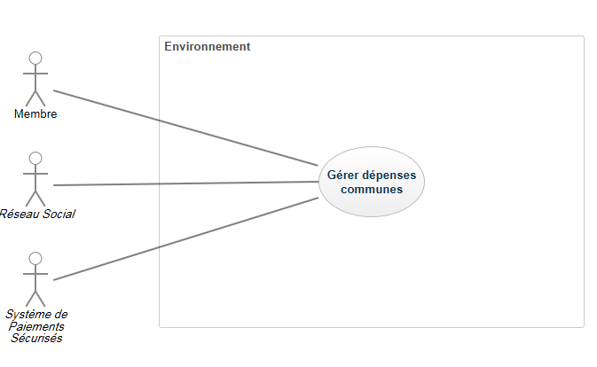

# I	Fondements du projet
## 1. But du projet
### a. Problème de l’utilisateur ou contexte du projet 
Lors de départs en vacances ou cotisations de groupes, il est souvent éprouvant de faire les comptes afin de savoir qui a payé quoi. C'est pour cette raison que nous développons EsayBill.
###b. Objectifs du projet
EasyBill aura pour objectif de gérer des dépenses communes. L'application devra aussi garder en tout temps une cohérences par rapport aux sommes individuelles et globale qui sont dépensés. EasyBill devra aussi êtrer capable de proposer des entrés manuelles de sommes.
##2. Personnes et organismes impliqués dans les enjeux du projet 
###a. Maître d’ouvrage
L'équipe tornjak.
###b. Acheteur
Profesionnels et particuliers ayants un accès au Google Play Store ou Apple Store.
###c. Autre parties prenantes
(N/A).
##3. Utilisateurs du produit
###a.	Utilisateurs directs du produit

Nous souhaitons viser un plublic très large. Notre application se destine à tout type d'utilisateur ayant pour objectif la gestions de dépenses communes.
###b. Priorité assignée aux utilisateurs
L'utilisateur qui a créé la dépense commune pourra ajouter des membres, et gérer quelques options de qu'un utilisateur lambda.
Une division de dépense doit être validé par toutes les personnes concernées avant d'être prise en compte.

###c. Implication nécessaire de la part des utilisateurs dans le projet
Aucun.

###d. Utilisateurs concernés par les opérations de maintenance du produit
Aucun.

#II	Contraintes sur le projet
##4. Contraintes non négociables

###a. Contraintes sur la conception de la solution
| ID | Description                                                                              | Justification                                                | Critères de satisfaction                                                                                         |
|----|------------------------------------------------------------------------------------------|--------------------------------------------------------------|------------------------------------------------------------------------------------------------------------------|
| 1  | Le produit doit tourner sur tous les smartphones sous Andoid à partir de la version 3.0. | Afin d'être compatible avec un maximum d'appareils           | L'application est téléchargeable et opérationnelle depuis le Play Store depuis n'importe quel smartphone sous Android 3.0 et plus. |
| 2  | L'application doit être programmée en java.                                              | Afin d'être compatible avec les autres applications Android. | L'application peut interagir avec d'autres applications comme Facebook pour se connecter.                        |
###b. Environnement de fonctionnement du système actuel
L'application fonctionnant sur mobile devra supporter la redirection vers des sites sécurisés de paiements en ligne. De plus, l'utilisateur pourra se connecter à l'application avec son compte Facebook ou Twitter.
###c. Applications « partenaires » (avec lesquelles le produit doit collaborer)
Au lancement, l'application pourra communiquer avec les applications Facebook et Twitter de la manière suivante : 
les comptes liés à ces applications pourront être utilisés pour se connecter sur easybill.
###d. « COTS » : Progiciels ou composants commerciaux
Aucun composant commercial ou progiciel est imposé.
###e. Lieux de fonctionnement prévus
L'application peut s'utiliser n'importe où. Il se peut donc que dans certaines circonstances, les notifications sonore soient inefficaces.
###f. De combien de temps les développeurs disposent-ils pour le projet ?
Les developpeurs disposent de 6 mois pour réaliser une première version de l'application.
###g. Quel est le budget affecté au projet ?
Le budget affecté est de 20 000€.
##5. Glossaire et conventions de dénomination
<ul>
<li>Activité : matérialisation d'un évènement partagé par plusieurs personnes, qui a mené à une dépense commune.</li><li>Compte : couple composé d'un identifiant public unique et d'un mot de passe privé qui permet de se connecter à l'application.</li>
<li>Option : élément visuel et cliquable de l'application permettant de réaliser une action.</li>
<li>Transaction : virement d'argent d'un compte vers un autre.</li>
</ul>
##6. Faits et hypothèses utiles
###a. Facteurs influençant le produit, mais qui ne sont pas des contraintes imposées sur les exigences
Rien en particulier.
###b. Hypothèses que l’équipe fait sur le projet 
Facebook et Twitter conserveront leur popularité. 

#III	Exigences fonctionnelles
##7. Portée du travail
###a. La situation actuelle
Il existe actuellement différentes applications qui permettent de gérer son budget en vacances. On peut notamment citer Splitwise, Tricount ou Cospender.
Quelque soit la dépense, il suffit d'entrer le montant total dépensé, et l'application sépare la facture.
L’application va ensuite calculer qui doit de l’argent à qui.
Cospender permet notamment de rentrer les sommes hors-ligne, ce qui est un véritable atout. De plus, l'application se gère depuis un seul téléphone : c'est
la même personne qui gère le budget du groupe. Ainsi, aucun compte ne doit être créer, il suffit de rentrer dans l'application les noms de nos co-voyageurs.
Quant à Splitwise, il faut impérativement un compte et on peut facilement le lier à ses réseaux sociaux. C'est un avantage lorsque l'on
veut synchroniser l'application avec la version disponible sur Internet. C'est un peu plus lourd lorsqu'on est en voyage et qu'on n'a pas forcément
ela possibilité d'avoir Internet afin de se connecter aux réseaux sociaux.
Enfin, Tricount permet aussi de faire ses comptes depuis Internet ou depuis son application. Mais sans compte, on ne peut pas les synchroniser.
On peut aussi s'y connecter à partir des réseaux sociaux. Un grand avantage est qu'elle fonctionne totalement hors-ligne et gère les dépenses inégales.
Dans l'application que nous proposons, nous souhaitons faire un mélange entre ses trois applications afin d'en tirer le meilleur. Ainsi on
pourra se connecter via des réseaux sociaux ou non. Mais on gérera aussi les dépenses inégales et fonctionnera hors-ligne.
###b. Contexte du travail
Non traité dans FilRouge 
###c. Division du travail en événements métier
Non traité dans FilRouge 
##8. Portée du produit (cas d’utilisations)

###a. Limites du produit : diagramme de cas d’utilisation

###b. Description sommaire des cas d’utilisation

Voir en Annexe 1 la liste des exigences utilisateur.
##9. Exigences fonctionnelles et exigences sur les données
###a. Exigences fonctionnelles
Nous n'avons pas, dans le cadre de ce projet, d'exigences fonctionnelles.
#IV	Exigences non fonctionnelles
##10. Ergonomie et convivialité du produit
###a. L’interface
Non Applicable (N/A)
###b. Le style du produit (packaging inclus)
N/A
##11. Facilité d’utilisation et facteurs humains 
###a. Facilité d’utilisation
Le produit devra être simple d'utilisation. Le public visé étant l'ensemble de la population, disons à partir de 15 ans, tout le monde doit être capable de s'en
servir sans rencontrer de difficultés de prise en main.
L'usage de cette application, qui vise principalement des personnes voyageant occasionnellement, doit être simple de mémorisation.
De l'argent étant en jeu, le taux d'erreur ne pourra pas excéder 2% des calculs.
Il est important de rendre notre produit attractif et qu'il plaise afin de pouvoir se démarquer.
Le produit ne devra pas forcément calculer en temps réel les différentes sommes.
###b. Personnalisation et internationalisation
Le produit doit permettre à son utilisateur de changer de langue par défaut.
Le produit doit permettre à son utilisateur de changer la devise de la monnaie.
Le produit doit permettre à son utilisateur de réinitialiser les sommes.
###c. Facilité d’apprentissage
Le produit doit être facile à prendre en main par tout utilisateur sans utiliser de manuel.
###d. Facilité de compréhension et politesse
Le produit devra contenir des icones simples et mot-clés comme boutons.
Le produit pourra jouer des sons différents lorsque l'on cliquera sur des icones différents.
Le produit devra cacher tout ce qui ne concerne pas les utilisateurs.
###e. Exigences d’accessibilité
Le produit devra pouvoir être utilisé par les personnes ayant des problèmes de vues.
##12. Fonctionnement du produit
###a. Rapidité d’exécution et temps de latence
N/A
###b. Exigences critiques de sûreté
N/A
###c. Précision et exactitude
N/A
###d. Fiabilité et disponibilité
N/A
###e. Robustesse ou tolérance à un emploi erroné
N/A
###f. Capacité de stockage et montée en charge
N/A
###g. Adaptation du produit à une augmentation de volume à traiter
N/A
###h. Longévité
N/A
##13. Adéquation du produit avec son environnement
###a. Environnement physique prévu
Le produit sera utilisé sur différents types de smartphones.
Le produit sera parfois utilisé en extérieur, dans des environnements bruyants.
###b. Environnement technologique prévu
Il s'agira de systèmes embarqués, contenant différents systèmes d'exploitation.
###c. Applications « partenaires » (avec lesquelles le produit doit collaborer) 
Le produit doit pouvoir accéder aux comptes des réseaux sociaux des utilisateurs. Il faudra échanger les logins et mots de passes. Le volume échangé sera donc relativement faible.
###d. Approche « produit » prêt à être commercialisé
Le produit doit pouvoir être installé facilement sur les smartphones.
Le produit doit être léger.
##14. Maintenance, support, portabilité, installation du produit
###a. Maintenance du produit
N/A
###b. Conditions spéciales concernant la maintenance du produit
N/A
###c. Exigences en matière de support
N/A
###d. Exigences de portabilité
N/A
###e. Installation du système
N/A
##15. Sécurité
###a. Accès au système
N/A
###b. Intégrité
N/A
###c. Protection des données à caractère personnel
N/A
###d. Audit et traçabilité
N/A
###e. Protection contre les infections
N/A
##16. Exigences culturelles et politiques 
###a. Exigences culturelles
N/A
###b Exigence politiques
N/A
##17. Lois et standards influençant le produit
###a. Conformité avec la loi
N/A
###b. Conformité avec des standards
N/A

#Annexe 1 : Liste des exigences utilisateur

| ID 	| Catégories 	| Description 	| Justification 	| Critères de satisfaction 	| Contentement MOA 	| Mécontentement MOA 	| 
|----	|------------	|-------------	|---------------	|--------------------------	|------------------	|--------------------	|
|  1  	|     Utilisateur       	|  Le produit devra permettre aux utilisateurs de se créer un compte       	|    Afin de pouvoir savoir quel membre doit de l'argent à un autre et de gérer l'historique          		|  L'utilisateur doit pouvoir se connecter avec un identifiant unique et un mot de passe associé 	|        2          	|    5             	|             	                      	
|  2  	|     Utilisateur       	|       Le produit devra être utilisable hors-ligne      	|   Les membres n'ont pas forcément de connexion à internet 24h/24 |  L'application doit conserver sur un support de stockage les dernières infos mises à jour afin qu'elles soient consultables même sans connexion internet   	|       4           	|        3           	|                       	                    
|  3  	|     Utilisateur       	|    Les membres doivent valider les transactions entrées par les autres membres         	|     Afin qu'il n'y ait aucun membre qui fraude sur la somme réellement dépensée          	 	|   Lors de l'initialisation d'une transaction, un message de validation devra être envoyé aux différents comptes entrant en jeu dans celle-ci. La transaction ne sera prise en compte qu'après validation par tous les utilisateurs concernés   	|        3          	|    3                	                   	|
|  4    |    Utilisateur         |         Le produit devra permettre à un membre de quitter une activité à tout instant      |   Chaque membre peut ne pas participer à un voyage aussi longtemps que les autres membres                   |  La description d'un activité doit contenir une option pour la quitter  |    4               |      4                                  |
|  5    |     Utilisateur        |       Le produit doit pouvoir gérer des sous-groupes de membres        |    Afin de permettre à des couples ou des membres qui payeraient ensemble d'être pris en compte équitablement avec les autres membres                      |   Dans les paramètres d'un compte, il devra être possible d'associé un compte secondaire correspondant à un proche   |         2          |             3        |        
|  6    |      Utilisateur       |   Le produit devra permettre aux membres d'entrer les sommes dépensées            |   Afin de pouvoir ensuite faire les calculs des remboursements mutuels                       |           Une option de création de somme commune devra être présente dans le menu principal de l'application                 |        2           |     5                |          
|  7    |   Utilisateur      |    Il est possible d'utiliser un compte de réseau social pour se connecter     |  Les futurs membres n'auront pas à créer de compte pour profiter de l'application            |   Au lancement de l'application, celle-ci laisse le choix à l'utilisateur de se connecter avec un compte de réseau social ou un compte easybill      |   4    |    2    |    

